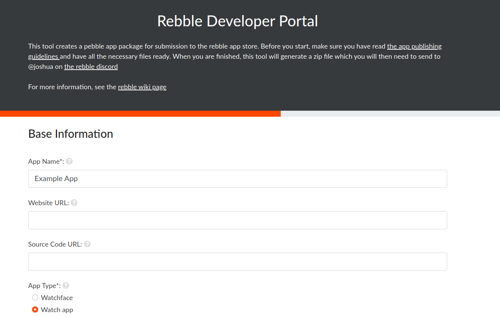

# Rebble Dev portal

## Intro

The developer portal is for developers of apps or watchfaces who want to deploy their application to the [rebble appstore](https://apps.rebble.io). As per [this post](https://github.com/pebble-dev/wiki/wiki/Preparing-a-new-app-for-the-Rebble-App-Store), you can get your app on the appstore by creating a .zip with a yaml file and all the resources. This project provides a form which accepts your project resources and automatically creates the .yaml file, wrapping everything up in a nice .zip.   

## Production

Production deployment is available at [rebble.io/submit](https://rebble.io/submit)

## Future Improvements

See Issues

